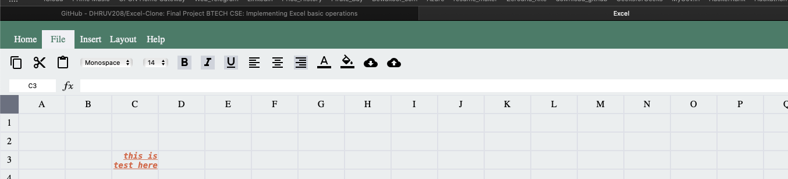
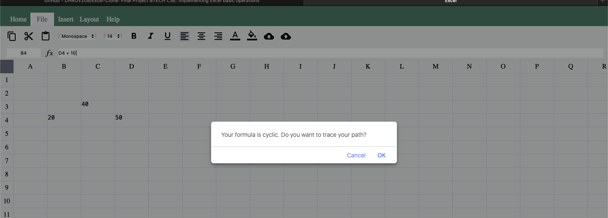

DR-Xcel : Final Project Btech CSE
Project Partner: Rishabh Jain

# one way binding notes
    - cell properties modify
    - cell properties storage
    - two way binding (data modify & UI render)

#### image 1 : 

#### image 2 : 

#### image 3 : 

#### image 4 : 

#### image 5 : 

#### image 6 : 
